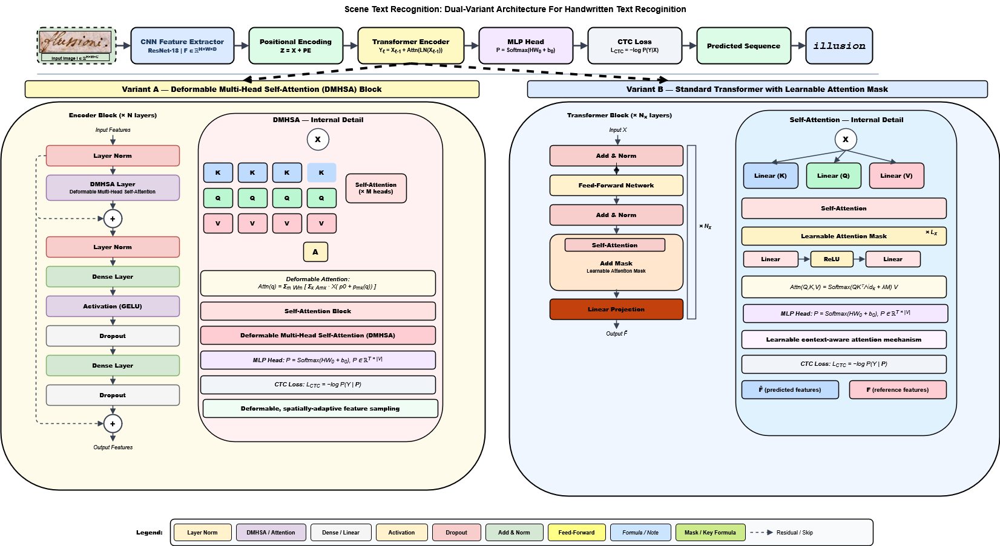

📙 LM-HTR: Learnable Masking Attention for Historical Text Recognition

<p align="center">

[](https://drive.google.com/drive/folders/1HuucUqMokyE3_bmXoBkrWcnpwWA9wFPk?usp=sharing)
[](https://drive.google.com/drive/folders/1EN9LSKbl5_pMqcBDQsm8nXP4oKT7ACoo?usp=sharing)

</p>


🔗 Paper & Resources

📄 PRL Paper: LM-HTR: Learnable Masking Attention for Historical Text Recognition  
📊 Supplementary:  
⭐ Highlights:  


🧠 Introduction

Handwritten Text Recognition (HTR) remains a challenging problem due to:

- Variability in handwriting styles  
- Degradation (noise, bleed-through, fading)  
- Irregular spacing and structure  

To address these challenges, we propose LM-HTR, a Transformer-based framework that introduces spatially selective attention mechanisms for robust recognition.  

Unlike standard Vision Transformers, our approach suppresses noisy background regions while emphasizing informative handwriting features.

🔗 Resources:  
📂 [Datasets](https://drive.google.com/drive/folders/1HuucUqMokyE3_bmXoBkrWcnpwWA9wFPk?usp=sharing)  
📦 [Checkpoints](https://drive.google.com/drive/folders/1EN9LSKbl5_pMqcBDQsm8nXP4oKT7ACoo?usp=sharing)   


## 🚀 Key Contributions

- Introduces Learnable Masking Attention for noise suppression  
- Incorporates Deformable Attention for adaptive spatial focus  
- Improves robustness without pretraining or language models  
- Achieves strong results on IAM, LAM, and READ2016 datasets  

### As highlighted in your work:

- Better CER/WER across datasets  
- Strong performance in degraded manuscripts  
- Fully end-to-end training with CTC loss  


🏗️ Architecture Overview

<p align="center">
  
</p>


📊 Visual Results

<p align="center">
  
</p>

The framework follows a CNN → Transformer → CTC pipeline:

1. CNN backbone extracts visual features  
2. Transformer encoder models sequence dependencies  
3. Spatial attention (masking / deformable) enhances focus  
4. CTC decodes final text sequence  


📂 Repository Structure

```bash
HTR-VT/
├── data/                         # Dataset storage
├── deformable_attention/         # Deformable attention modules
├── learnable_masking_attention/  # Masking attention implementation
├── line_images/                  # Input line images
├── mistral_api/                  # OCR API comparison scripts
├── paper_images/                 # Figures for README / paper
├── results/                      # Output predictions
├── scripts/                      # Training & testing scripts
├── utils/                        # Utility functions
├── example/                      # Example files
├── environment.yaml              # Environment setup
├── README.md                     # Project documentation
└── .gitignore

⚙️ Installation

Step 1: Create Environment

conda env create -f environment.yaml
conda activate htr


Requirements

Python 3.9

PyTorch 1.13

GPU recommended

 
📁 Datasets

data/
└── iam/
    ├── train.ln
    ├── val.ln
    ├── test.ln
    └── lines/
        ├── xxx.png
        └── xxx.txt
        

▶️ Quick Start

Train

python scripts/train.py

Validate

python scripts/valid.py

Test

python scripts/test.py

./scripts/


📈 Results

| Dataset  | CER (%) | WER (%) |
|----------|---------|---------|
| LAM      | 3.60    | 9.94    |
| READ2016 | 4.27    | 17.83   |
| IAM      | 4.97    | 16.24   |


🔍 Comparison with OCR APIs

- Mistral OCR  
- Gemini OCR
  
Findings:

- Poor performance on degraded datasets  
- High error rates without adaptation  
- Domain mismatch for historical manuscripts  

🧪 Evaluation Metrics

- Character Error Rate (CER)  
- Word Error Rate (WER)  
Computed using Levenshtein distance.

🔮 Future Work

- Hybrid attention  
- Self-supervised pretraining  
- Paragraph-level recognition  
- Language-aware decoding

🙏 Acknowledgement

- Transformer-based HTR models  
- Deformable attention frameworks  
- Masked attention techniques  

⭐ Support

Please consider starring the repository.


